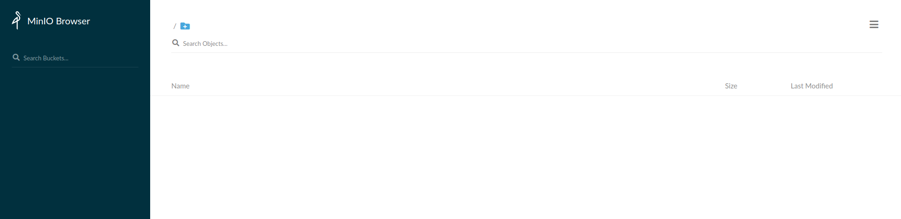
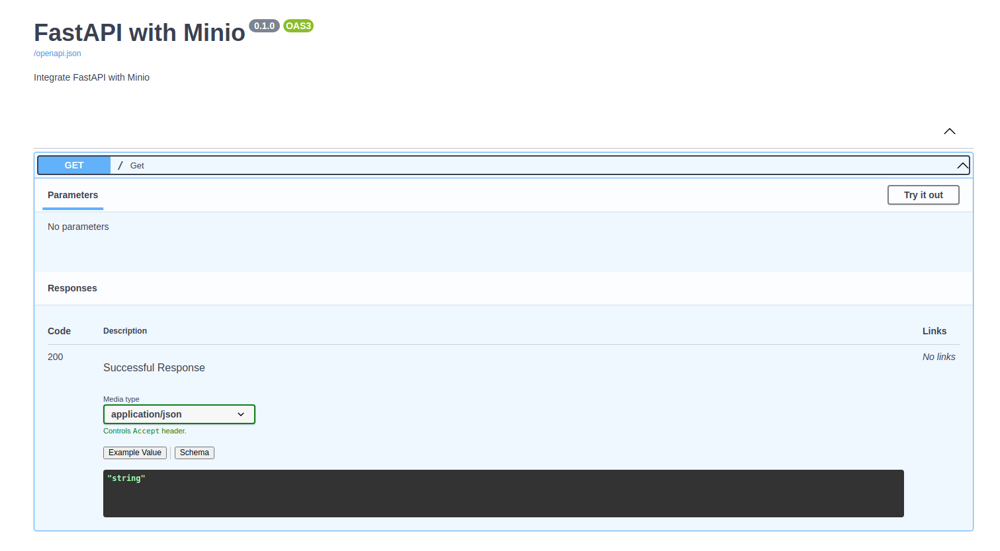
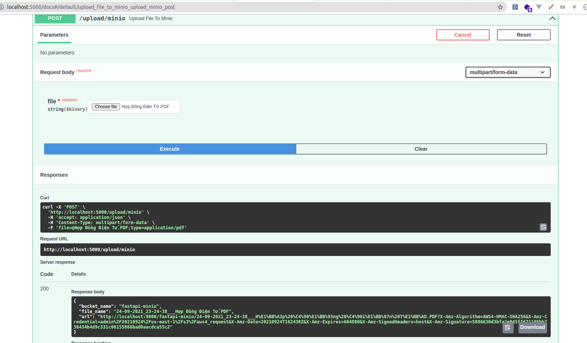
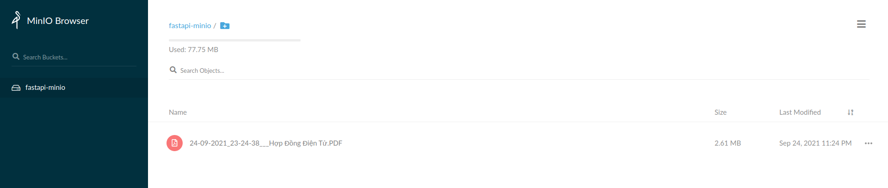
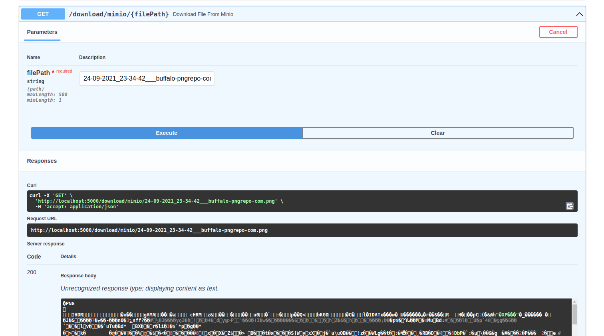

# Tích hợp FastAPI với Minio

## Minio là gì, tại sao dùng Minio?
Về cơ bản thì
> Minio is a high performance distributed object storage server, designed for large-scale private cloud infrastructure.

Nói ngắn gọn thì Minio giống như Amazon S3, nhưng có thể dùng được ở local.

Thực tế thì hiện tại với sự phát triển của mô hình microservice và sự ra đời của Docker, K8S, thông thường quy trình release một Service Application sẽ là:
1. Xây dựng Dockerfile
2. Công cụ auto deploy thực hiện docker build để sinh ra image tương ứng
3. Đẩy image lên K8S và dựng thành container, cấu hình và setup network
4. Release cho khách hàng

Trước đây, khi làm việc với Django, khi làm những việc liên quan đến upload 
file, hầu như mình đều lưu file vào cùng thư mục với code (đặt ở **/public** hoặc
**/media** chẳng hạn). Nhưng ở thời điểm hiện tại, khi tích hợp Docker và K8S, 
việc deploy manual và lưu trữ file cùng server với code đã không còn sử
dụng được nữa. Khi upload file chúng ta buộc phải kết nối đến một server lưu trữ
data phòng trường hợp K8S restart lại container, mọi dữ liệu liên quan đến 
file đều mất hết. Về mặt bảo mật và chi phí lưu trữ, Minio có lợi thế khi sử dụng
được ở server nội bộ và giảm tải chi phí khi phải thuê các công cụ lưu trữ bên ngoài
như Google Simple Storage hay Amazon S3. Vì vậy các công ty rất thích điều này.

Bài viết này sẽ trình bày ngắn gọn cách kết nối tới Minio từ FastAPI hay từ Python 
nói chung.

## Cài đặt Minio
Ở đây chúng ta sử dụng Docker để cài Minio luôn vì đằng nào cũng phải dùng Docker
để test Dockerfile

Tại main folder tạo folder .docker để lưu data từ minio vào local, file docker-compose.yaml
và nginx.conf

```
project
│   .docker
│   docker-compose.yaml 
│   nginx.conf 
```

Thêm vào docker-compose.yaml
```
version: '3.7'

services:
  minio1:
    image: minio/minio:RELEASE.2020-12-12T08-39-07Z
    volumes:
      - .docker/minio/data1-1:/data1
      - .docker/minio/data1-2:/data2
    expose:
      - "9000"
    environment:
      MINIO_ACCESS_KEY: admin
      MINIO_SECRET_KEY: password@123
    command: server http://minio{1...2}/data{1...2}
    healthcheck:
      test: [ "CMD", "curl", "-f", "http://localhost:9000/minio/health/live" ]
      interval: 30s
      timeout: 20s
      retries: 3

  minio2:
    image: minio/minio:RELEASE.2020-12-12T08-39-07Z
    volumes:
      - .docker/minio/data2-1:/data1
      - .docker/minio/data2-2:/data2
    expose:
      - "9000"
    environment:
      MINIO_ACCESS_KEY: admin
      MINIO_SECRET_KEY: password@123
    command: server http://minio{1...2}/data{1...2}
    healthcheck:
      test: [ "CMD", "curl", "-f", "http://localhost:9000/minio/health/live" ]
      interval: 30s
      timeout: 20s
      retries: 3

  minio-nginx:
    image: nginx:1.19.2-alpine
    volumes:
      - ./nginx.conf:/etc/nginx/nginx.conf:ro
    expose:
      - "9000"
    ports:
      - "9000:9000"
    depends_on:
      - minio1
      - minio2
```

Nội dung nginx.conf
```

user  nginx;
worker_processes  auto;

error_log  /var/log/nginx/error.log warn;
pid        /var/run/nginx.pid;


events {
    worker_connections  1024;
}


http {
    include       /etc/nginx/mime.types;
    default_type  application/octet-stream;

    log_format  main  '$remote_addr - $remote_user [$time_local] "$request" '
                      '$status $body_bytes_sent "$http_referer" '
                      '"$http_user_agent" "$http_x_forwarded_for"';

    access_log  /var/log/nginx/access.log  main;

    sendfile        on;
    #tcp_nopush     on;

    keepalive_timeout  65;

    #gzip  on;

    # include /etc/nginx/conf.d/*.conf;

    upstream minio {
        server minio1:9000;
        server minio2:9000;
    }

    server {
        listen       9000;
        listen  [::]:9000;
        server_name  localhost;

         # To allow special characters in headers
         ignore_invalid_headers off;
         # Allow any size file to be uploaded.
         # Set to a value such as 1000m; to restrict file size to a specific value
         client_max_body_size 0;
         # To disable buffering
         proxy_buffering off;

        location / {
            proxy_set_header Host $http_host;
            proxy_set_header X-Real-IP $remote_addr;
            proxy_set_header X-Forwarded-For $proxy_add_x_forwarded_for;
            proxy_set_header X-Forwarded-Proto $scheme;

            proxy_connect_timeout 300;
            # Default is HTTP/1, keepalive is only enabled in HTTP/1.1
            proxy_http_version 1.1;
            proxy_set_header Connection "";
            chunked_transfer_encoding off;

            proxy_pass http://minio;
        }
    }
}

```
Sử dụng docker-compose để run
`$ docker-compose up -d`

Mở trình duyệt và test tại http://localhost:9000/minio/login, tài khoản là **admin/password@123**
như đã setup ở file docker-compose


## Cài đặt & check FastAPI
Vài bước cơ bản với tất cả các project liên quan đến FastAPI
```
$ virtualenv -p python3 .venv
$ source .venv/bin/active
$ pip install fastapi uvicorn
$ touch main.py
```
Nội dung file **main.py**
```
# main.py

import uvicorn
from fastapi import FastAPI
from starlette.middleware.cors import CORSMiddleware


def get_application() -> FastAPI:
    application = FastAPI(
        title='FastAPI with Minio',
        description='Integrate FastAPI with Minio',
        openapi_url="/openapi.json",
        docs_url="/docs"
    )

    application.add_middleware(
        CORSMiddleware,
        allow_origins=['*'],
        allow_credentials=True,
        allow_methods=["*"],
        allow_headers=["*"],
    )

    return application


app = get_application()


@app.get('/', tags=[''])
def get():
    return 'Hello World'


if __name__ == "__main__":
    uvicorn.run("main:app", host="0.0.0.0", port=5000, reload=True)
```
Run project `$ python main.py`  
Check lại trên trình duyệt: http://localhost:5000/docs


## Cài đặt python-minio, cài đặt các phương thức make_bucket, put_object
Quay lại CLI, ctrl + C để stop project, cài đặt python minio
```
$ pip install minio
```
Tạo file **minio_handler.py** ở cùng thư mục với **main.py**
```
project
│   .docker
│   docker-compose.yaml 
│   nginx.conf 
│   minio_handler.py 
```
Nội dung **minio_handler.py**, trong đó có 3 function chính:
- make_bucket để tạo bucket trên minio
- put_object để push file lên Minio
- presigned_get_object để get file url khi đã push lên minio

```
# minio_handler.py

import random
from datetime import datetime, timedelta

from minio import Minio


class MinioHandler():
    __instance = None

    @staticmethod
    def get_instance():
        """ Static access method. """
        if not MinioHandler.__instance:
            MinioHandler.__instance = MinioHandler()
        return MinioHandler.__instance

    def __init__(self):
        self.minio_url = 'localhost:9000'
        self.access_key = 'admin'
        self.secret_key = 'password@123'
        self.bucket_name = 'fastapi-minio'
        self.client = Minio(
            self.minio_url,
            access_key=self.access_key,
            secret_key=self.secret_key,
            secure=False,
        )
        self.make_bucket()

    def make_bucket(self) -> str:
        if not self.client.bucket_exists(self.bucket_name):
            self.client.make_bucket(self.bucket_name)
        return self.bucket_name

    def presigned_get_object(self, bucket_name, object_name):
        # Request URL expired after 7 days
        url = self.client.presigned_get_object(
            bucket_name=bucket_name,
            object_name=object_name,
            expires=timedelta(days=7)
        )
        return url

    def check_file_name_exists(self, bucket_name, file_name):
        try:
            self.client.stat_object(bucket_name=bucket_name, object_name=file_name)
            return True
        except Exception as e:
            print(f'[x] Exception: {e}')
            return False

    def put_object(self, file_data, file_name, content_type):
        try:
            datetime_prefix = datetime.now().strftime("%d-%m-%Y_%H-%M-%S")
            object_name = f"{datetime_prefix}___{file_name}"
            while self.check_file_name_exists(bucket_name=self.bucket_name, file_name=object_name):
                random_prefix = random.randint(1, 1000)
                object_name = f"{datetime_prefix}___{random_prefix}___{file_name}"

            self.client.put_object(
                bucket_name=self.bucket_name,
                object_name=object_name,
                data=file_data,
                content_type=content_type,
                length=-1,
                part_size=10 * 1024 * 1024
            )
            url = self.presigned_get_object(bucket_name=self.bucket_name, object_name=object_name)
            data_file = {
                'bucket_name': self.bucket_name,
                'file_name': object_name,
                'url': url
            }
            return data_file
        except Exception as e:
            raise Exception(e)

```
## Tạo API để Upload file
Để upload file trong FastAPI, cài đặt python-multipart
```
$ pip install python-multipart
```
Tạo API upload file trong main.py
```
# main.py

...
from pydantic import BaseModel
from io import BytesIO
from fastapi import File, UploadFile
from minio_handler import MinioHandler
...

class CustomException(Exception):
    http_code: int
    code: str
    message: str

    def __init__(self, http_code: int = None, code: str = None, message: str = None):
        self.http_code = http_code if http_code else 500
        self.code = code if code else str(self.http_code)
        self.message = message


class UploadFileResponse(BaseModel):
    bucket_name: str
    file_name: str
    url: str


@app.post("/upload/minio", response_model=UploadFileResponse)
async def upload_file_to_minio(file: UploadFile = File(...)):
    try:
        data = file.file.read()

        file_name = " ".join(file.filename.strip().split())

        data_file = MinioHandler().get_instance().put_object(
            file_name=file_name,
            file_data=BytesIO(data),
            content_type=file.content_type
        )
        return data_file
    except CustomException as e:
        raise e
    except Exception as e:
        if e.__class__.__name__ == 'MaxRetryError':
            raise CustomException(http_code=400, code='400', message='Can not connect to Minio')
        raise CustomException(code='999', message='Server Error')

```
Upload thử file

Check lại trên Minio, ở đây Minio đã tạo ra bucket fastapi-minio và đã upload thành công file


## Tạo API để Download file
Tạo API Download File trong main.py
```
# main.py
...
from pydantic import BaseModel
from io import BytesIO
from fastapi import File, UploadFile, Path
from starlette.responses import StreamingResponse
...

@app.get("/download/minio/{filePath}")
def download_file_from_minio(
        *, filePath: str = Path(..., title="The relative path to the file", min_length=1, max_length=500)):
    try:
        minio_client = MinioHandler().get_instance()
        if not minio_client.check_file_name_exists(minio_client.bucket_name, filePath):
            raise CustomException(http_code=400, code='400',
                                  message='File not exists')

        file = minio_client.client.get_object(minio_client.bucket_name, filePath).read()
        return StreamingResponse(BytesIO(file))
    except CustomException as e:
        raise e
    except Exception as e:
        if e.__class__.__name__ == 'MaxRetryError':
            raise CustomException(http_code=400, code='400', message='Can not connect to Minio')
        raise CustomException(code='999', message='Server Error')
```
Thử Download file từ minio bằng cách call API download trên trình duyệt qua swagger

Hoặc đơn giản hơn, call file bằng cách dùng URL http://localhost:5000/download/minio/24-09-2021_23-34-42___buffalo-pngrepo-com.png
với 24-09-2021_23-34-42___buffalo-pngrepo-com.png là tên file nhận được sau khi call API
Upload


## Kết luận
Thực tế việc tích hợp FastAPI với Minio khá là đơn giản, vì những function cơ bản đã có
library của minio cung cấp sẵn. Bạn có thể thao khảo tất cả các hàm làm việc khác với Minio tại trang
chủ Minio https://docs.min.io/docs/python-client-quickstart-guide.html

Để run project này, follow CLI:
```
$ git clone https://github.com/Longdh57/fastapi-minio.git
$ cd fastapi-minio
$ mkdir .docker
$ docker-compose up -d
$ virtualenv -p python3 .venv
$ source .venv/bin/active
$ pip install -r requirement.txt
$ python main.py
```
See result on web browser: http://localhost:5000/docs
